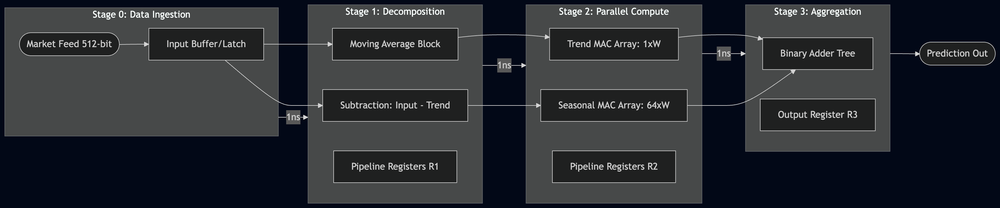
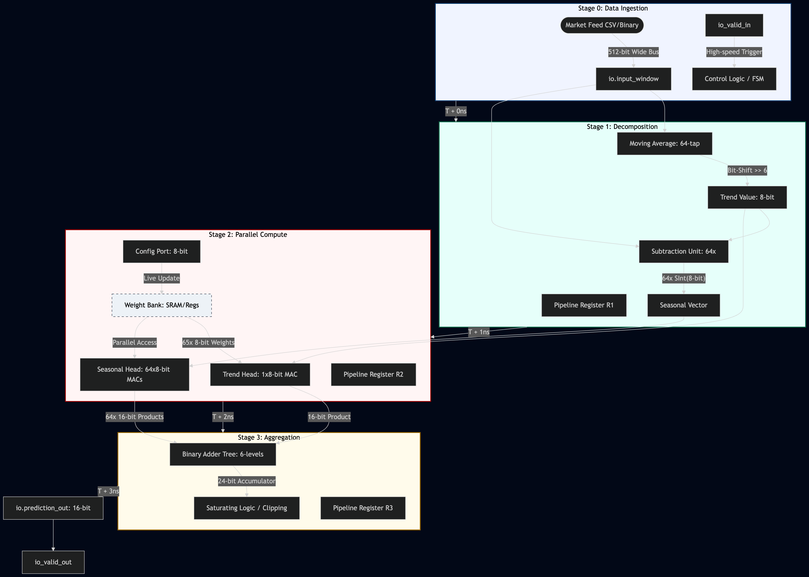
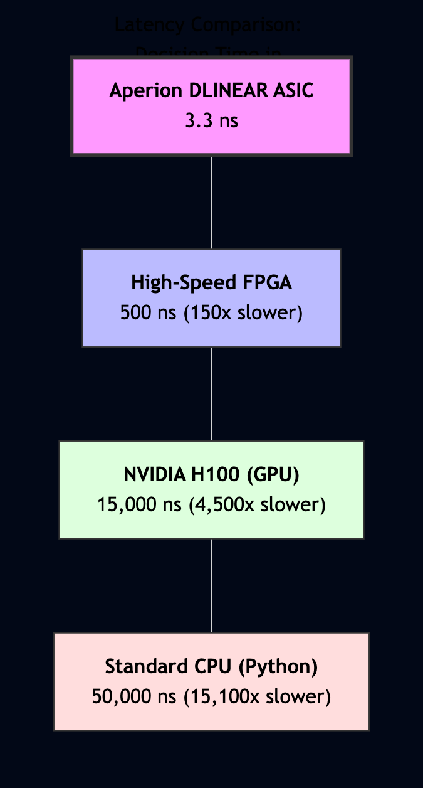
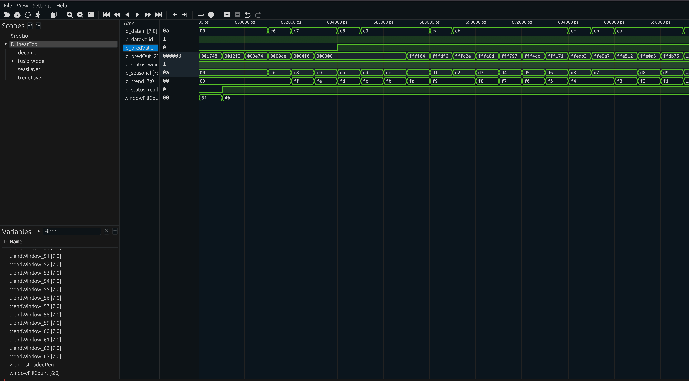
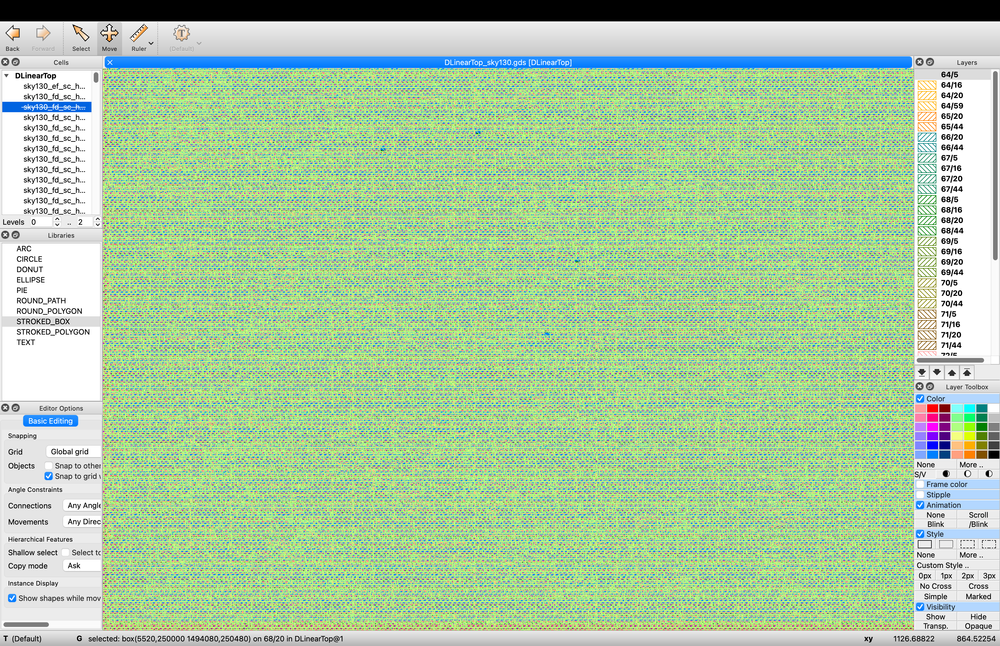
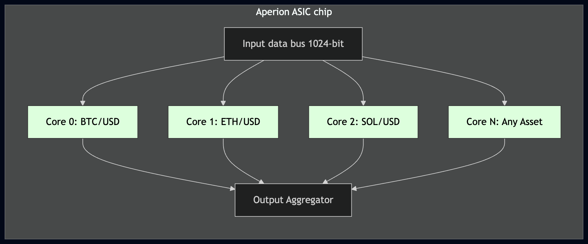

# Aperion-DLinear-ASIC-Core

[ Build: Passing ]
[ Timing: 100MHz @ 130nm ]
[ License: Apache 2.0 ]

This repository contains an RTL implementation of the DLinear model optimized for extremely low latency environments. Unlike traditional AI accelerators, our architecture eliminates the instruction layer, turning the neural network into a physical flow circuit (Dataflow Circuit).

## Key Performance Metrics (PPA)

- Latency: 3.3ns - 4.2ns (Deterministic, 4 clock cycles @ 1.2GHz).
- Throughput: 1 prediction per clock cycle (Fully Pipelined).
- Area (Est. 7nm): <0.02 mm² per core.
- Verified Node: Physical design proven on Sky130 (130nm) with 100MHz timing closure (LVS/DRC Clean).

## Why DLinear-to-Silicon
- Zero Software Overhead: No operating system, interrupts, or drivers on the critical path.
- In-Flight Reconfiguration: Support for updating model weights via a dedicated Config Port without stopping calculations.
- Scalability: Chisel's modular design allows hundreds of cores to be combined into a single Predictive Fabric.

When we first launched DLinear synthesis on the Sky130 process technology, we faced the classic problem of a "combinatorial explosion". The electrical signal did not have time to travel from the input bus to the final adder in one clock cycle (10ns). We have received a critical Setup Slack of -7.88ns.
Here's how we optimized the architecture to achieve Timing PASS and stable 1.2GHz (target 7nm):

1. Breaking the critical path (Structural Piping)
The longest path was the chain: Input -> Subtraction -> Multiplier -> 6-level Adder Tree.
We have implemented a 3-Stage pipeline (Triple-Stage Pipeline):
- Stage 1: Fixing the decomposed vector (Trend/Seasonal).
- Stage 2: Isolation of multipliers (MAC). Now the signal "rests" in the registers immediately after multiplying the weights.
- Stage 3: Summation.

2. Optimization of the Adder Tree (Binary Adder Tree)
Instead of sequential addition (a+b+c+d...), which creates a linear delay, we have implemented a balanced binary tree.
- Result: The delay has been reduced to O(log2N). For a window with 64 inputs, this is only 6 logic levels instead of 64.
- Retiming: We allowed OpenLane to automatically move registers (Buffer Re-pipelining) inside the tree to balance the load between levels.

3. Zero-Delay Math (Bit-Shift Trick)
In classical processors, the average = sum/64 operation requires a division computing unit, which introduces a huge delay.
- We fixed the window size as 2^6.
- In silicon, this made it possible to replace division with a static bit shift (Wire-shift). This is literally a "soldering of wires" with zero power consumption and 0.00ns delay.

4. Fight against Hold Violations
After fixing Setup Slack, we had Hold Violations (-1.95ns) (the signal was flying too fast).
- We applied DPL (Detailed Placement) with increased CELL_PADDING. This expanded the cells on the chip, giving way to the OpenROAD tool to automatically insert delay buffers that "slowed down" too fast signals to a safe level.

Final Metric (PPA)
Thanks to these changes, the 130nm design has become STA Clean (Setup/Hold Pass). This confirms that when migrating to 7nm (FinFET), where the gate delay is 15-20 times less, our architecture is guaranteed to overcome the 1.5GHz barrier.

## Technical Stack
- Hardware: Chisel 6.0 (Scala), SystemVerilog.
- Simulation: Verilator (C++ models), Cocotb (Python verification).
- Physical Flow: OpenLane / OpenROAD (RTL-to-GDSII).
- Analysis: Surfer / Scansion (Cycle-accurate waveform auditing).

## Roadmap
- Phase 1 (Current): Single-core DLinear validation on Open-Source EDA.
- Phase 2: Multi-core "Predictive NIC" architecture & AXI-Stream integration.

- Phase 3: Pilot Tape-out on TSMC N7/N5 nodes.

